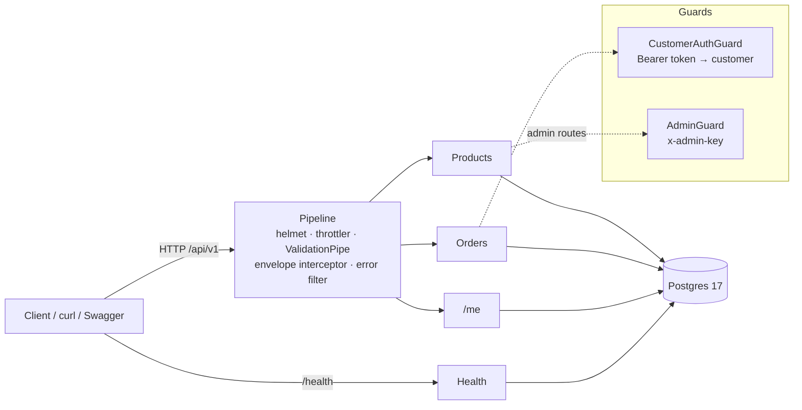

# CommercePilot

E-commerce backend (products, customers, orders), extended over four tasks with a conversational shopping
assistant and link-based bulk product import.

**Start it:** `docker compose up --build` → API on `:3000/api/v1`, Swagger on `/docs`, health on `/health`. Details in [RUN.md](RUN.md).

| Task | Scope                                                | Status      | Tag      |
| ---- | ---------------------------------------------------- | ----------- | -------- |
| 0    | Foundation: products, customers, orders              | Done        | `task-0` |
| 1    | Assistant answers product questions from the catalog | Not started | —        |
| 2    | Assistant searches, checks orders, places orders     | Not started | —        |
| 3    | Operator bulk import from a link                     | Not started | —        |

## Architecture



- `src/<feature>/` holds module, controller (HTTP plus DTO mapping), service (business rules), and `dto/` (input DTOs
  and `*-response.dto.ts`).
- `src/common/` holds the Prisma module, auth guards, the global exception filter, and `http/` (response envelope,
  `Paginated`, `MoneyDto`).
- One response contract everywhere: `{ success, data, meta }` or `{ success: false, error: { code, … } }` (see below).
- Decisions are recorded in [`docs/adr/`](docs/adr).

## Task 0 — Foundation

**Data model:** `Product` (unique `sku`, `priceCents`, `stock`, JSON `attributes`, `active`), `Customer`
(hashed API token), `Order` (status, `totalCents`) and `OrderItem` (price snapshot at purchase time).

**API**: business routes are under `/api/v1`; `/health` and `/docs` are at the root. The full endpoint reference is
**[docs/API.md](docs/API.md)**, generated from the code (`pnpm docs:api`, checked in CI), so it can't drift.
In short:

- **Catalog (public):** search, filter and paginate products, list categories, get one product.
- **Admin (`x-admin-key`):** create products, partial update (stock only via a relative `stockDelta`).
- **Customer (bearer token):** `/me`, place an order (`{ items: [{ productId, quantity }] }`), list and get own orders.

**Correctness properties (each covered by a test)**

- Ordering is atomic: each row is locked by a conditional decrement (`active AND stock >= qty`), and prices are read
  only after the lock is held. If any line fails, nothing changes. 8 concurrent orders for 3 units → exactly 3
  succeed, 5 get `409`, and stock ends at 0.
- Lines are locked in a fixed order (sorted by id), so concurrent orders for the same products in opposite order
  can't deadlock.
- Totals that would overflow the `INTEGER` column are rejected with `400`. Admin stock changes are relative and
  conditional, so a restock can't erase concurrent sales.
- Clients cannot set prices or totals. Unknown fields are rejected (`400`), and unit prices are snapshotted from the DB.
- Duplicate lines are merged before the quantity cap applies, so a cap of 50 can't be bypassed by splitting lines.
- The seed is idempotent (upsert by natural key), so the container can restart without duplicating data, and it never
  resets a rotated customer token.

**Response contract** ([ADR 0003](docs/adr/0003-response-contract-and-versioning.md))

```jsonc
// success: single resource, or a list with pagination in meta
{ "success": true, "data": { … } | [ … ], "meta": { "requestId": "…", "page": 1, "pageSize": 20, "total": 48, "totalPages": 3 } }
// failure: machine-readable code, optional field-level details
{ "success": false, "error": { "code": "VALIDATION_FAILED", "message": "Request validation failed",
  "details": [{ "field": "items.0.quantity", "messages": ["quantity must not be less than 1"] }], "requestId": "…" } }
```

- Responses are explicit DTOs, never DB rows. Money is `{ amountCents, currency, formatted }`.
- Error codes include `VALIDATION_FAILED`, `UNAUTHORIZED`, `PRODUCT_NOT_FOUND`, `ORDER_NOT_FOUND`,
  `INSUFFICIENT_STOCK`, `QUANTITY_LIMIT_EXCEEDED`, `ORDER_TOTAL_TOO_LARGE`, `ALREADY_EXISTS`, `PAYLOAD_TOO_LARGE`,
  `MIXED_CURRENCY`, `NOT_FOUND`, `TOO_MANY_REQUESTS`, `DEPENDENCY_UNAVAILABLE` and `INTERNAL_ERROR`.
- Every request gets a `requestId`, returned in `meta`/`error` and in the `x-request-id` header and logged.
  A well-formed incoming `x-request-id` is reused for tracing.
- Swagger (`/docs`) documents the request DTOs, the success envelope per endpoint, and the error envelope.

## Engineering setup

| Layer       | What                                                                                                                                                                                                                                                                                                                                                 |
| ----------- | ---------------------------------------------------------------------------------------------------------------------------------------------------------------------------------------------------------------------------------------------------------------------------------------------------------------------------------------------------- |
| Code style  | ESLint flat config (`typescript-eslint` type-checked) + Prettier + `.editorconfig`; TypeScript `strict` + `noUncheckedIndexedAccess`                                                                                                                                                                                                                 |
| Git hooks   | Husky: `pre-commit` → lint-staged · `commit-msg` → commitlint (Conventional Commits) · `pre-push` → typecheck + unit tests + API-docs drift check                                                                                                                                                                                                    |
| CI          | GitHub Actions: lint, format, typecheck, API-docs drift check, unit + e2e against Postgres, `docker compose up --wait` smoke test, gitleaks                                                                                                                                                                                                          |
| AI workflow | `CLAUDE.md` (short project rules), `.claude/rules/*` (testing, security, API, docs map), `.claude/settings.json` (permissions + hooks: format-on-edit, block hook bypass / force-push / reading `.env`, typecheck and **docs guard** before the agent stops), `.claude/skills/` (`finish-task`, `add-assistant-tool`), `.claude/agents/docs-auditor` |

## Keeping docs in sync

Docs are enforced by tools, not left to memory ([ADR 0004](docs/adr/0004-docs-as-code-enforcement.md)):

1. **Generated.** `docs/API.md` and `docs/openapi.json` are built from the route metadata (`pnpm docs:api`). The
   Swagger UI and the reference share one OpenAPI builder.
2. **Agent guard.** A Claude Code `Stop` hook blocks "done" when code changed but no doc did, and points to the docs
   map (`.claude/rules/docs.md`, which says which file owns which kind of change). It also blocks when `src/` is newer
   than the generated spec. The "no doc touched" check fires once per change set (a justified "no doc change" is
   accepted), and `stop_hook_active` means a blocked stop is never re-blocked in a loop.
3. **Audit.** The `docs-auditor` subagent checks every concrete claim in the docs against the code before each task
   is committed (part of `/finish-task`).
4. **Gates.** `pnpm docs:check` (regenerate, then `git diff --exit-code`) runs on `pre-push` and in CI.

## Review before tagging

Before tagging, Task 0 went through a code review and a security review (Claude Code `/code-review` plus a
dedicated security-review agent). The transcript contains both reports. Fixed: the lock-order deadlock, the
price/active read race, the int32 total overflow, middleware 4xx errors returned as 500, admin absolute-stock
overwrites, the unpaginated order list, a lenient `inStock` parser, `PORT` not read from validated config, Postgres
and the API published on all interfaces (now `127.0.0.1` only), possible secrets in the Docker build context, app
code writable by the app user in the image, CI token permissions and unpinned actions, unvalidated `x-request-id`,
and gaps in the agent guard hook.

Deliberately **not** changed:

- **Swagger stays on with `NODE_ENV=production`**, because reviewers use `/docs`. A real deployment would put it
  behind a flag.
- **`trust proxy` is not set**, because the app isn't behind a proxy. Setting it without one would let clients spoof
  `X-Forwarded-For` and evade the rate limit. Set it to the real hop count when deploying behind a load balancer.
- **The compose fallback admin key and the public demo tokens stay** so the brief's clean-clone start works. They are
  safe because both ports bind to loopback only. Use a real key in the env file for anything else.

## Assumptions

- **Auth is minimal on purpose:** customers authenticate with seeded bearer tokens (stored hashed), and operators with
  a single `x-admin-key`. Signup, passwords, sessions and roles are out of scope for this brief.
- Single currency per order (`USD` seed data); mixed-currency orders are rejected.
- Orders are created as `CONFIRMED` (no payment step). `PENDING`/`SHIPPED`/`CANCELLED` exist for history and
  assistant questions.
- Brands and products in `fixtures/` are fictional. Demo customer tokens are public test data for local evaluation.

## Exclusions

Payments, shipping/tax calculation, order cancellation/refunds, customer signup, product images, a UI,
full-text/vector search (ILIKE is sufficient for this catalog size, marked `ponytail:` in code).

## Incomplete work

None for Task 0.

## External services

| Provider         | Purpose                                       | Needed by          |
| ---------------- | --------------------------------------------- | ------------------ |
| Docker Hub       | `postgres:17-alpine`, `node:22-alpine` images | Task 0+ (runtime)  |
| npm registry     | Dependencies at image build time              | Task 0+ (build)    |
| GitHub / Actions | Public repository and CI                      | Task 0+ (delivery) |

## Transcripts

`transcripts/task-N.jsonl` are the raw Claude Code session logs (JSON Lines, including tool calls and tool output),
copied unedited from `~/.claude/projects/…/<session>.jsonl`. There is one session per task. Planning for the whole
assignment happened at the start of the Task 0 session, so it is in `task-0.jsonl`.

They are delivered **in the submission zip only**, at the top-level `transcripts/` folder, and are kept out of this
public repository (`transcripts/` is gitignored). Raw logs contain local environment details such as file paths and
account metadata, which don't belong in a public repo. A log is also still being written while its task is
committed, so it couldn't be part of that commit anyway.

After Task 3, a separate session (2026-10-04) wrote the brief's submission guidelines into `.claude/rules/submission.md`
and folded that file into the Task 0 commit. Tasks 1–3 were rebased onto it unchanged and all four tags were recreated.
That session's log ships as `transcripts/task-0-rules.jsonl`.

## Time log

Self-timed. Times are local (UTC+6) and include planning, research and verification.

| Task | Start            | End   | Spent  | Notes                                                                                                                                                                                                                                                                                                                                                                                                    |
| ---- | ---------------- | ----- | ------ | -------------------------------------------------------------------------------------------------------------------------------------------------------------------------------------------------------------------------------------------------------------------------------------------------------------------------------------------------------------------------------------------------------- |
| 0    | 2026-10-02 11:21 | 15:33 | 4h 12m | Session clock times, including planning for all four tasks and tooling research (Nest 12 ESM, Prisma 7). **Overran by 1h 12m**: first build done at 13:58 (2h 37m), then a code + security review round and fixes (40 min), a response-contract pass (envelope, response DTOs, /api/v1, richer /health; 21 min) and a docs-enforcement pass (generated API docs, docs guard hook, docs auditor; 34 min). |
